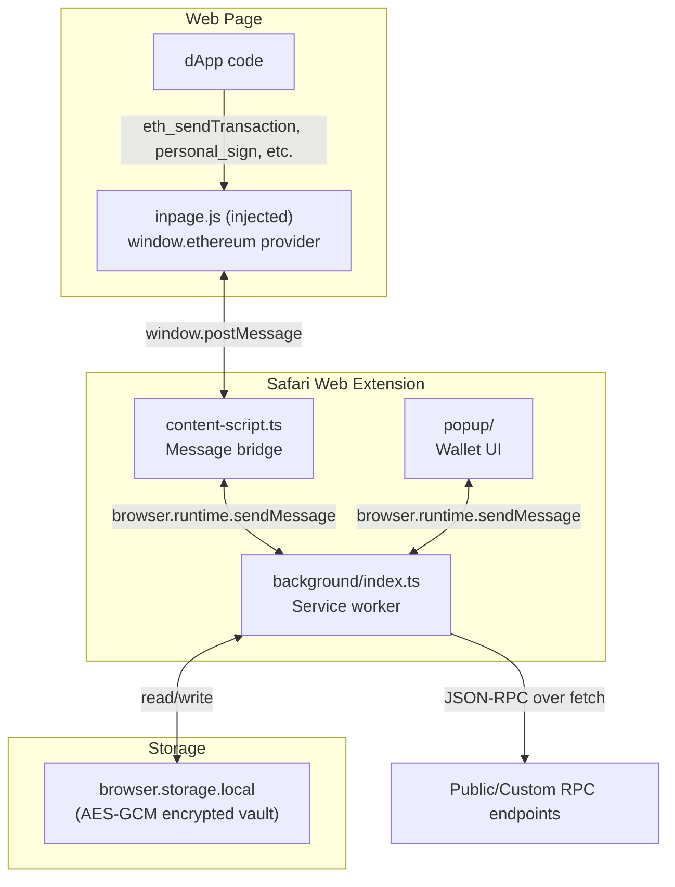

# Safari EVM Wallet Extension

## Architecture



**Key design decisions:**

- **macOS Safari only** — single-platform Xcode project
- **Web-based popup UI** — TypeScript + Preact (3KB, React-compatible API) for small bundle size
- **viem** for all EVM interactions (accounts, signing, RPC, ABI encoding)
- **Encrypted vault** in `browser.storage.local` — keys encrypted with AES-GCM using a password-derived key (PBKDF2)
- **No native messaging** for MVP — keeps complexity low; all crypto in JS

## Project Structure

```
safari-evm-wallet/
├── package.json
├── tsconfig.json
├── vite.config.ts
├── src/
│   ├── background/
│   │   ├── index.ts              # Service worker entry
│   │   ├── wallet.ts             # HD wallet (mnemonic, accounts)
│   │   ├── vault.ts              # Encrypted storage (AES-GCM + PBKDF2)
│   │   ├── rpc-handler.ts        # JSON-RPC method router
│   │   └── networks.ts           # Chain definitions
│   ├── content/
│   │   └── index.ts              # Bridge: page <-> background
│   ├── inpage/
│   │   └── provider.ts           # EIP-1193 provider (window.ethereum)
│   ├── popup/
│   │   ├── index.html
│   │   ├── main.tsx              # Preact entry
│   │   ├── App.tsx               # Router + auth guard
│   │   ├── pages/
│   │   │   ├── Welcome.tsx       # First-time setup (create/import)
│   │   │   ├── Unlock.tsx        # Password entry
│   │   │   ├── Home.tsx          # Balance + token list
│   │   │   ├── Send.tsx          # Send ETH/tokens
│   │   │   ├── Approve.tsx       # TX/message signing approval
│   │   │   └── Settings.tsx      # Networks, accounts, export
│   │   ├── components/
│   │   └── styles/
│   ├── shared/
│   │   ├── messages.ts           # Message type definitions
│   │   ├── types.ts              # Shared types
│   │   └── constants.ts          # Chain list, defaults
│   └── manifest.json             # Web Extension manifest v3
├── xcode/                         # Xcode project
│   ├── SafariEVMWallet/           # Container app (minimal Swift)
│   └── SafariEVMWallet Extension/ # Extension target
└── scripts/
    └── build.sh                   # Build TS + copy to Xcode resources
```

## Tech Stack

| Layer              | Technology                                             |
| ------------------ | ------------------------------------------------------ |
| Extension logic    | TypeScript, viem                                       |
| Popup UI           | Preact + TypeScript + CSS Modules                      |
| Bundler            | Vite (multi-entry: background, content, inpage, popup) |
| Key derivation     | BIP-39 mnemonic via viem/accounts (HDKey)              |
| Encryption         | Web Crypto API (PBKDF2 + AES-GCM)                      |
| Storage            | browser.storage.local                                  |
| Native container   | Swift / Xcode (minimal)                                |
| Extension manifest | Manifest V3 (Safari-compatible subset)                 |

## Pre-configured Networks

Ethereum Mainnet, Sepolia, Polygon, Arbitrum One, Optimism, Base, BSC, Avalanche C-Chain — plus ability to add custom RPC.

## Implementation Phases

### Phase 1: Project Scaffold + Build Pipeline

- Initialize npm project with TypeScript, Vite, Preact, viem
- Configure Vite for multi-entry build (background, content, inpage, popup)
- Create `manifest.json` (Manifest V3 with required permissions)
- Create Xcode project via `safari-web-extension-converter` or manually
- Wire `build.sh` to copy Vite output into the Xcode extension resources folder
- Verify the extension loads in Safari with a "Hello World" popup

### Phase 2: Encrypted Vault + Wallet Core

- Implement `vault.ts`: password hashing (PBKDF2), AES-GCM encrypt/decrypt, store/retrieve from `browser.storage.local`
- Implement `wallet.ts`: generate mnemonic (BIP-39), derive accounts (BIP-44 m/44'/60'/0'/0/x), import from private key
- Implement lock/unlock lifecycle in the background service worker (auto-lock on idle timer)
- Unit-test vault encryption round-trip and key derivation

### Phase 3: Popup UI — Onboarding + Home

- `Welcome.tsx`: create new wallet (show mnemonic, confirm backup) or import (mnemonic / private key)
- `Unlock.tsx`: password entry, unlock vault
- `Home.tsx`: display selected account address, ETH balance, simple ERC-20 token list (fetch via RPC `eth_getBalance` + `eth_call` for ERC-20 `balanceOf`)
- `Settings.tsx`: switch network, view accounts, add account, export private key (with password confirmation)
- Network selector component (dropdown with pre-configured chains)

### Phase 4: EIP-1193 Provider + dApp Connection

- `inpage/provider.ts`: implement the `window.ethereum` object conforming to EIP-1193
  - `request({ method, params })` — main entry
  - Events: `connect`, `disconnect`, `chainChanged`, `accountsChanged`
  - Methods: `eth_requestAccounts`, `eth_accounts`, `eth_chainId`, `wallet_switchEthereumChain`, `wallet_addEthereumChain`
- `content/index.ts`: inject `inpage.js` into page via `<script>` tag, relay messages between page and background using `window.postMessage` and `browser.runtime.sendMessage`
- `background/rpc-handler.ts`: route incoming JSON-RPC requests — proxy read calls directly to the chain RPC, intercept write calls (signing) for user approval
- Implement EIP-6963 provider announcement (`window.dispatchEvent` with `eip6963:announceProvider`) for modern dApp discovery

### Phase 5: Transaction + Message Signing

- `Approve.tsx`: approval popup for pending transactions and message signing requests
  - Show: origin, method, parsed transaction details (to, value, gas estimate), or message content
  - Allow user to adjust gas (simple: slow/normal/fast presets)
  - Confirm / Reject buttons
- Background handles: `eth_sendTransaction` (build, sign with viem, broadcast), `eth_signTransaction`, `personal_sign`, `eth_sign`, `eth_signTypedData_v4`
- RPC proxy: all other `eth_*` methods (e.g. `eth_blockNumber`, `eth_getTransactionReceipt`) forwarded to the chain RPC

### Phase 6: Send ETH/Tokens from Popup

- `Send.tsx`: form with recipient address, amount, token selector (ETH or known ERC-20s)
- Gas estimation and confirmation before signing
- Transaction status tracking (pending -> confirmed/failed)

### Phase 7: Polish + Security Hardening

- Auto-lock after configurable idle timeout (default 5 min)
- Input validation and error handling throughout
- Content Security Policy in manifest
- Rate limiting on failed password attempts
- Clear plaintext keys from memory after lock
- Test with popular dApps (Uniswap, OpenSea, Aave) to verify EIP-1193 compatibility
- Basic UI polish: loading states, toast notifications, responsive popup sizing (Safari popup is ~400x600px)
